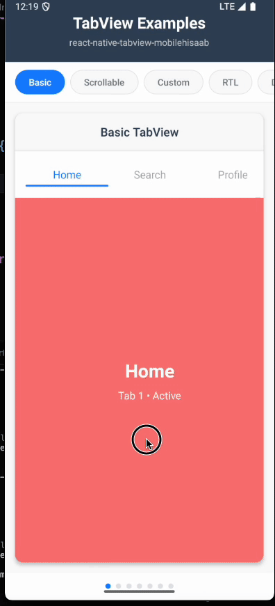

# React Native TabView - MobileHisaab

A **beautiful**, **smooth**, and **highly customizable** React Native TabView component with RTL support, fluid animations, and gesture handling. Built with React Native Reanimated 3 for optimal performance.


## 🎬 Demo



_Smooth tab transitions with animated indicator and fluid content switching_

## 📱 Live Example

Check out the complete working example with multiple TabView configurations:

**[View Example on GitHub](https://github.com/ap9101/tabview-example.git)**

```bash
git clone https://github.com/ap9101/tabview-example.git
cd tabview-example
npm install
# Run on iOS
npx react-native run-ios
# Run on Android
npx react-native run-android
```

## ✨ Features

- 🎨 **Beautiful Design** - Modern, clean UI with smooth animations
- 🚀 **High Performance** - Built with React Native Reanimated 3
- 📱 **Responsive** - Adapts to different screen sizes
- 🌍 **RTL Support** - Full right-to-left language support
- 🎯 **Gesture Handling** - Smooth swipe gestures with react-native-gesture-handler
- 🎭 **Dark Mode** - Built-in dark/light theme support
- 🔧 **Highly Customizable** - Extensive styling options
- ⚡ **TypeScript** - Full TypeScript support
- 🎪 **Smooth Animations** - Fluid tab transitions and indicator animations

## 📦 Installation

### 1. Install the package

```bash
npm install react-native-tabview-mobilehisaab
# or
yarn add react-native-tabview-mobilehisaab
```

### 2. Install peer dependencies

This package requires the following peer dependencies:

```bash
npm install react-native-reanimated react-native-gesture-handler
# or
yarn add react-native-reanimated react-native-gesture-handler
```

### 3. Platform-specific setup

#### iOS

```bash
cd ios && pod install
```

#### Android

Add to `android/app/src/main/java/.../MainActivity.java`:

```java
import com.swmansion.gesturehandler.react.RNGestureHandlerEnabledRootView;
```

For React Native Reanimated, add to `babel.config.js`:

```javascript
module.exports = {
  plugins: [
    "react-native-reanimated/plugin", // This should be last
  ],
};
```

## 🚀 Quick Start

```tsx
import React, { useState } from "react";
import { View, Text, StyleSheet } from "react-native";
import { TabView } from "react-native-tabview-mobilehisaab";

const App = () => {
  const [index, setIndex] = useState(0);

  const routes = [
    { key: "first", title: "First Tab" },
    { key: "second", title: "Second Tab" },
    { key: "third", title: "Third Tab" },
  ];

  const renderScene = ({ route, index, isActive }) => {
    switch (route.key) {
      case "first":
        return (
          <View style={styles.scene}>
            <Text style={styles.text}>First Tab Content</Text>
          </View>
        );
      case "second":
        return (
          <View style={styles.scene}>
            <Text style={styles.text}>Second Tab Content</Text>
          </View>
        );
      case "third":
        return (
          <View style={styles.scene}>
            <Text style={styles.text}>Third Tab Content</Text>
          </View>
        );
      default:
        return null;
    }
  };

  return (
    <TabView
      routes={routes}
      initialIndex={index}
      onIndexChange={setIndex}
      renderScene={renderScene}
    />
  );
};

const styles = StyleSheet.create({
  scene: {
    flex: 1,
    justifyContent: "center",
    alignItems: "center",
    backgroundColor: "#f5f5f5",
  },
  text: {
    fontSize: 18,
    fontWeight: "600",
    color: "#333",
  },
});

export default App;
```

## 🎨 Advanced Usage

### Custom Styling

```tsx
<TabView
  routes={routes}
  initialIndex={index}
  onIndexChange={setIndex}
  renderScene={renderScene}
  tabBarStyle={{
    backgroundColor: "#ffffff",
    shadowColor: "#000",
    shadowOffset: { width: 0, height: 2 },
    shadowOpacity: 0.1,
    shadowRadius: 8,
    elevation: 4,
  }}
  activeTabStyle={{
    backgroundColor: "#007AFF",
    borderRadius: 12,
  }}
  activeLabelStyle={{
    color: "#ffffff",
    fontWeight: "600",
  }}
  labelStyle={{
    color: "#666666",
    fontWeight: "500",
  }}
  indicatorStyle={{
    backgroundColor: "#007AFF",
    height: 3,
    borderRadius: 2,
  }}
/>
```

### RTL Support

```tsx
<TabView
  routes={routes}
  initialIndex={index}
  onIndexChange={setIndex}
  renderScene={renderScene}
  isRTL={true} // Enable RTL support
/>
```

### Indicator Toggle

You can choose between animated indicator or background highlighting:

```tsx
// With indicator (default)
<TabView
  routes={routes}
  initialIndex={index}
  onIndexChange={setIndex}
  renderScene={renderScene}
  showIndicator={true} // Shows animated indicator, no background
/>

// With background highlighting
<TabView
  routes={routes}
  initialIndex={index}
  onIndexChange={setIndex}
  renderScene={renderScene}
  showIndicator={false} // Shows background color, no indicator
  activeTabStyle={{
    backgroundColor: "#007AFF",
    borderRadius: 12,
  }}
/>
```

### Dark Mode

The component automatically adapts to your app's color scheme, but you can also customize it:

```tsx
<TabView
  routes={routes}
  initialIndex={index}
  onIndexChange={setIndex}
  renderScene={renderScene}
  tabBarStyle={{
    backgroundColor: "#1a1a1a", // Dark background
  }}
  activeLabelStyle={{
    color: "#ffffff",
  }}
  labelStyle={{
    color: "#cccccc",
  }}
/>
```

## 📚 API Reference

### Props

| Prop               | Type                              | Default | Description                    |
| ------------------ | --------------------------------- | ------- | ------------------------------ |
| `routes`           | `TabRoute[]`                      | `[]`    | Array of route objects         |
| `initialIndex`     | `number`                          | `0`     | Initial tab index              |
| `onIndexChange`    | `(index: number) => void`         | -       | Callback when tab changes      |
| `renderScene`      | `SceneRendererProps => ReactNode` | -       | Function to render tab content |
| `isRTL`            | `boolean`                         | `false` | Enable RTL support             |
| `scrollEnabled`    | `boolean`                         | `true`  | Enable tab bar scrolling       |
| `tabBarStyle`      | `ViewStyle`                       | -       | Custom tab bar style           |
| `tabStyle`         | `ViewStyle`                       | -       | Custom inactive tab style      |
| `activeTabStyle`   | `ViewStyle`                       | -       | Custom active tab style        |
| `labelStyle`       | `TextStyle`                       | -       | Custom inactive label style    |
| `activeLabelStyle` | `TextStyle`                       | -       | Custom active label style      |
| `indicatorStyle`   | `ViewStyle`                       | -       | Custom indicator style         |
| `showIndicator`    | `boolean`                         | `true`  | Show/hide animated indicator   |

### Types

```tsx
interface TabRoute {
  key: string;
  title: string;
}

interface SceneRendererProps {
  route: TabRoute;
  index: number;
  isActive: boolean;
}
```

## 🎯 Performance Tips

1. **Lazy Loading**: Only render active and adjacent tabs for better performance
2. **Memoization**: Use `React.memo` for your scene components
3. **Image Optimization**: Optimize images in tab content
4. **Avoid Heavy Computations**: Move heavy operations outside render

```tsx
const MemoizedScene = React.memo(({ route, index, isActive }) => {
  // Your scene content
  return <YourSceneComponent />;
});
```

## 🐛 Troubleshooting

### Common Issues

1. **Tabs not scrolling smoothly**

   - Ensure react-native-reanimated is properly installed
   - Check if babel.config.js includes the reanimated plugin

2. **Gesture handling not working**

   - Verify react-native-gesture-handler installation
   - Make sure to wrap your app with GestureHandlerRootView

3. **TypeScript errors**
   - Update @types/react-native to latest version
   - Ensure peer dependencies are installed

### Installation Issues

If you encounter installation issues:

```bash
# Clean install
rm -rf node_modules package-lock.json
npm install

# iOS
cd ios && rm -rf Pods Podfile.lock && pod install

# Android
cd android && ./gradlew clean
```

## 🤝 Contributing

We welcome contributions! Please see our [Contributing Guide](CONTRIBUTING.md) for details.

## 📄 License

MIT License - see the [LICENSE](LICENSE) file for details.

## 🙏 Acknowledgments

- Built with [React Native Reanimated](https://github.com/software-mansion/react-native-reanimated)
- Gesture handling by [React Native Gesture Handler](https://github.com/software-mansion/react-native-gesture-handler)
- Inspired by [react-native-tab-view](https://github.com/satya164/react-native-tab-view)

## 📞 Support

- 📧 Email: abdullah.return@gmail.com
- 🐛 Issues: [GitHub Issues](https://github.com/ap9101/react-native-tabview-mobilehisaab/issues)
- 💬 Discussions: [GitHub Discussions](https://github.com/ap9101/react-native-tabview-mobilehisaab/discussions)

---

Made with ❤️ by [Developer Ap]
